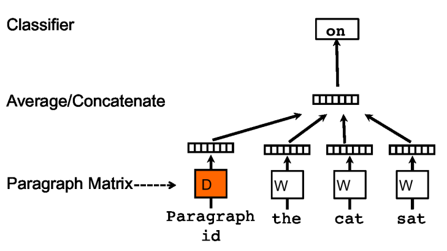
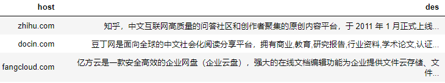

# Doc2vec

## 一、项目说明

Doc2vec的torch实现版本, 实现任务：PV-DM, 支持负采样



## 二、使用方法

### 2.1、数据组织形式
输入为两列, 第一列是doc的名称, 第二列是doc的内容


### 2.2、模型训练
模型保存在model文件夹中
```bash
python train.py \
    --input_dir='./data/doc2vec_sample.csv' \
    --test_dir='./data/doc2vec_sample.csv' \
    --embed_size=128 \
    --window_size=2 \
    --batch_size=64 \
    --hidden_size=128 \
    --learning_rate=0.001 \
    --weight_decay=0.01 \
    --isNegSample=False \
    --sample_size=-1 \
    --num_epochs='100' \
    --patience=15 \
```